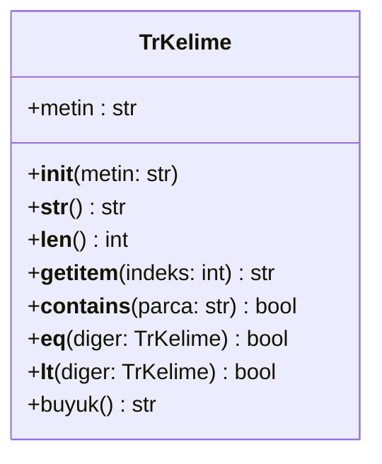

# Hafta 8 - TrKelime UML Diyagramı

```mermaid
classDiagram
    class TrKelime {
        +metin : str
        +__init__(metin: str)
        +__str__() str
        +__len__() int
        +__getitem__(indeks: int) str
        +__contains__(parca: str) bool
        +__eq__(diger: TrKelime) bool
        +__lt__(diger: TrKelime) bool
        +buyuk() str
    }
```
